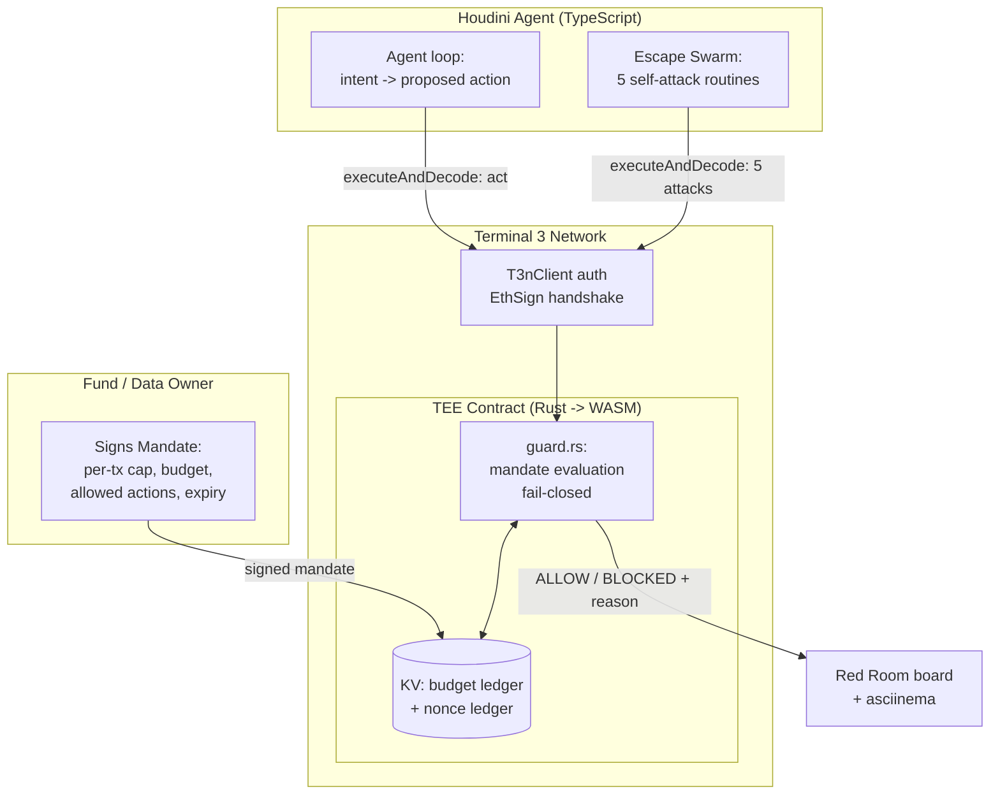

# feat: Houdini — the self-attacking agent on Terminal 3 ADK

> **Positioning (the sticky one-liner):** *"Houdini — the AI agent that tries to escape its own limits, and can't."*
> An agent runs a real budget under a hardware-enforced **mandate**, then unleashes 5 escape attempts on itself. Every one bounces off the TEE. Watch it fail, live.

---

## Summary

Houdini is a Terminal 3 ADK agent whose spending/action authority is bounded by a user-signed **mandate** that is **enforced inside a Rust→WASM TEE contract** (per-transaction cap, cumulative budget, action allowlist, nonce ledger — all evaluated and decremented in TEE KV, fail-closed). The product's memorable identity is that **the agent attacks itself**: a built-in "escape swarm" of 5 adversary routines (budget-bust, nonce replay, forged mandate, scope escalation, PII-exfiltration) hammer the mandate every run, and a live **Red Room** board shows them all bounce — a wall of `BLOCKED`.

This wins the $300 "best agent" bounty on all three axes by attacking the field's universal weakness: **every competitor claims security; nobody enforces it and nobody proves it.** Houdini enforces (in the enclave) and proves (adversarially, on camera).

Scope is one deployable, demoable vertical slice (a stablecoin/RWA treasury payment agent) optimized for the 40%-weighted stability/security criterion. Breadth (multi-vertical, marketplace, multi-tenant) is explicitly out.

---

## Problem Frame

Autonomous agents that touch money or private data are blocked by one question: **how do you let an agent act without trusting it not to overstep?** Today's answers are theater — limits are issued as credentials but never enforced at execution, signatures are checked for presence not validity, "attestation" is a log line. (Verified across 7 competitor submissions this cycle: andromeda issues budget caps it never reads; agentvault/agent-pass don't verify signatures; t3-veil's attestation is a no-op.)

Terminal 3's thesis — "privacy without compromise," "Agent Auth," hardware-attested mandates, TEEs — exists precisely to make agent authority *enforceable*. Houdini is the working proof of that thesis: the mandate is enforced where it can't be bypassed (inside the enclave), and Houdini demonstrates it by trying every bypass itself.

**Who is affected:** the data/fund owner (delegates a bounded mandate), the agent operator (gets a provably-safe agent), and T3 (sees its own roadmap shipped). Judge persona: a T3 team member who will remember "the agent that attacks itself."

---

## Requirements

- **R1** — A user-signed mandate defines: per-tx cap, cumulative budget, allowed action set, expiry, and a nonce/replay guard. (problem, security)
- **R2** — Mandate enforcement runs **inside the Rust→WASM TEE contract**, not in the TypeScript agent. Every spend/action is gated and the running total decremented in TEE KV. Fail-closed on any ambiguity. (security 40%)
- **R3** — Real `@terminal3/t3n-sdk@3.5.0` integration: `loadWasmComponent` → `new T3nClient({ wasmComponent, handlers })` → `handshake()` → `authenticate(createEthAuthInput(addr))` via `metamask_sign` EthSign handler. No mocks, no bearer tokens. (stability, security)
- **R4** — A real TEE contract compiled to `wasm32-wasip2` with correct host imports (`host:interfaces/* @2.1.0`, `host:tenant/tenant-context@1.0.0`), exporting a `contracts` interface — built and verified with `wasm-tools component wit`. (stability)
- **R5** — The "escape swarm": 5 adversary routines that each attempt a distinct bypass and assert it is rejected at the enclave boundary. (creativity, security)
- **R6** — A **Red Room** demo (CLI escape-matrix + recorded asciinema; web board optional) that shows, live, the agent acting within its mandate and every escape attempt being blocked. Graspable in <10s with no crypto knowledge. (creativity)
- **R7** — Green CI compiling the contract to `wasm32-wasip2` and running the escape swarm as a test matrix. Stability is *proven by the test suite*, not asserted. (stability 40%)
- **R8** — Honest labeling of what is live vs simulated (issuance, tenant deploy). No theater. (stability, trust with judges)

**Success criteria:** all 5 escape attempts rejected by the contract; the budget counter provably cannot exceed the mandate; CI green; a <90s demo video where Houdini visibly fails to escape; README that a T3 judge reads in 2 minutes and remembers.

---

## High-Level Technical Design

### Component shape



### The escape matrix (the memorable core)

| # | Escape trick | What Houdini tries | Enforced rejection (in TEE) |
|---|---|---|---|
| 1 | Budget-bust | Spend beyond cumulative budget / per-tx cap | `guard.rs` reads ledger, denies, ledger unchanged |
| 2 | Nonce replay | Re-submit a prior approved action | Nonce ledger marks spent → `replay_rejected` |
| 3 | Forged mandate | Present a mandate not signed by owner | EthSign / signature check fails → `forged_mandate` |
| 4 | Scope escalation | Call an action outside the allowlist | Action not in mandate set → `action_not_permitted` |
| 5 | PII exfil | Try to return profile PII across WIT boundary | Placeholders resolved host-side; raw PII never in WASM → `pii_forbidden` |

Each row is one ALLOW path (the legit action) and one BLOCKED path (the attack). The demo plays the matrix top to bottom: green action, red wall, green action, red wall.

---

## Output Structure

```
houdini/
├── contract/                  # Rust -> WASM TEE mandate guard
│   ├── src/
│   │   ├── lib.rs             # contracts::Guest dispatch (act / attack fns)
│   │   ├── guard.rs           # mandate evaluation, fail-closed
│   │   └── ledger.rs          # budget + nonce KV helpers
│   ├── wit/world.wit          # host:interfaces/* @2.1.0 imports, export contracts
│   └── Cargo.toml             # wasm32-wasip2, wit-bindgen 0.49, default-features=false
├── agent/
│   ├── src/
│   │   ├── t3.ts              # real SDK auth (load->client->handshake->authenticate)
│   │   ├── mandate.ts         # build + sign mandate (owner side)
│   │   ├── agent.ts           # legit agent loop (treasury payments)
│   │   └── swarm/             # 5 escape routines (one file each)
│   ├── test/                  # vitest: escape matrix assertions
│   └── package.json
├── redroom/                   # CLI escape-matrix renderer (web board = stretch)
├── .github/workflows/ci.yml   # build contract + run escape matrix
├── DEMO.md                    # 90s demo script + asciinema
└── README.md                  # 2-min judge read, positioning first
```

---

## Key Technical Decisions

- **KTD-1: Enforcement lives in Rust, not TypeScript.** The mandate check and ledger decrement happen in `guard.rs` inside the TEE, returning ALLOW/BLOCKED. The TS agent cannot self-approve. This is the entire differentiator vs the field — security is structural, not procedural. *(advances R2)*
- **KTD-2: Local enclave-faithful harness first; live tenant deploy as stretch.** T3's testnet register/auth path is the exact surface we documented as buggy (see `../FIXED-ONBOARDING.md`, BUGLOG BUG-01..04). Build against a faithful local host shim that mirrors `host:interfaces/* @2.1.0` semantics so the demo never flakes; attempt live `tenant.contracts.register` + `executeAndDecode` as a bonus once the slice is green. Label clearly which ran. *(advances R8; de-risks R3/R4)*
- **KTD-3: Crib correct SDK/WIT usage from the verified sample.** Reuse the real interface names, `Verb` enum, `payload`/`code` response shape, and `generic-input` envelope confirmed from `z-tenant-flight` + `FIXED-ONBOARDING.md` — avoids the doc bugs that will sink competitors copying the official docs. *(advances R3/R4)*
- **KTD-4: The self-attack is the product, the vertical is the stage.** Treasury/stablecoin payments chosen only because money makes "can't exceed the mandate" visceral and matches T3's "Permissioned DeFi / RWA & Stablecoins" segment. Keep domain logic thin. *(advances creativity, problem)*
- **KTD-5: Red Room ships as a CLI green-matrix + recorded asciinema first; web board only if time.** A terminal that prints the escape matrix live — green `✓ ALLOW` rows and red `✗ BLOCKED — <reason>` rows, with a budget gauge that visibly stops at the cap — is fast to build, reliable on camera, and reads in <10s. A minimal web board is a stretch (deferred), not the primary deliverable. The stickiness comes from the *matrix itself*, not the rendering tech. *(advances R6, creativity)*
- **KTD-6: Stability is proven by the escape matrix in CI.** Each attack is a test asserting the contract rejects it; CI compiles the contract to wasm and runs the matrix. Green CI = the security claim is machine-checked. *(advances R7, stability)*

---

## Implementation Units

### U1. Contract skeleton + correct WIT (TEE foundation)
- **Goal:** A `wasm32-wasip2` contract that builds and exports a `contracts` interface with the real host imports.
- **Requirements:** R4
- **Dependencies:** none
- **Files:** `houdini/contract/wit/world.wit`, `houdini/contract/Cargo.toml`, `houdini/contract/src/lib.rs`
- **Approach:** Copy the verified import set from `../z-tenant-flight/wit/world.wit` (`host:tenant/tenant-context@1.0.0`, `host:interfaces/{logging,kv-store}@2.1.0`; add `http` only if the treasury action needs egress). Export `contracts` with two functions: `act` (legit action) and `attack` (dispatch for the 5 escape attempts, tagged by kind) — both taking the `generic-input` envelope. `Cargo.toml` mirrors the sample (`crate-type=["cdylib","lib"]`, `wit-bindgen 0.49` with `default-features=false`).
- **Patterns to follow:** `../z-tenant-flight/Cargo.toml`, `../z-tenant-flight/src/lib.rs`, `../FIXED-ONBOARDING.md` §2.
- **Test scenarios:** Build succeeds for `wasm32-wasip2`; `wasm-tools component wit` shows `export ...:contracts` and `host:interfaces/*@2.1.0`. Covers R4. (Non-behavioral scaffold beyond the build assertion.)
- **Verification:** `cargo build --target wasm32-wasip2 --release` produces a `.wasm`; component WIT inspection matches expected imports/exports.

### U2. Mandate type + ledger (the enforceable rules)
- **Goal:** Define the mandate structure and the budget+nonce ledger in TEE KV.
- **Requirements:** R1, R2
- **Dependencies:** U1
- **Files:** `houdini/contract/src/ledger.rs`, `houdini/agent/src/mandate.ts`, `houdini/contract/src/guard.rs` (struct defs)
- **Approach:** Mandate = `{ owner_pubkey, per_tx_cap, budget_total, allowed_actions[], expiry, mandate_id }`. Ledger in KV under the tenant `secrets`/`ledger` map: `spent_total`, and a nonce set keyed by `mandate_id`. `mandate.ts` builds the canonical JSON and signs it owner-side (EthSign / secp256k1). KV reads use the runtime-built `z:<tid>:` map name per the sample's `get_api_key` pattern.
- **Patterns to follow:** `../z-tenant-flight/src/booking.rs` (`get_api_key` KV pattern), `../FIXED-ONBOARDING.md` §5–6.
- **Test scenarios:** mandate round-trips canonical JSON; ledger starts at 0; nonce set rejects duplicates; expiry in the past → mandate invalid. Edge: budget_total=0 → every spend blocked. Covers R1.
- **Verification:** unit tests on ledger + mandate parsing pass on host target.

### U3. `guard.rs` — fail-closed mandate evaluation (the core)
- **Goal:** The single function that decides ALLOW/BLOCKED for any action, enforced in-enclave.
- **Requirements:** R2
- **Dependencies:** U2
- **Files:** `houdini/contract/src/guard.rs`, test: `houdini/contract/src/guard.rs` (`#[cfg(test)]` mod)
- **Approach:** `evaluate(action, mandate, sig, nonce) -> Decision`. Order (all fail-closed): verify mandate signature → check expiry → check action ∈ allowed_actions → check nonce unused → check per_tx_cap → check spent+amount ≤ budget_total. Only on full pass: mark nonce spent, decrement budget, return ALLOW. Any failure → typed `BlockedReason` enum, ledger untouched. Return reasons mirror host-style strings (`action_not_permitted`, `replay_rejected`, etc.).
- **Execution note:** Implement test-first — write the 5 rejection tests before the evaluator, since these tests ARE the security proof.
- **Patterns to follow:** typed error enum like `../z-tenant-flight/src/booking.rs` `HttpError`.
- **Test scenarios:** ALLOW on a valid in-budget action; BLOCKED budget-bust (over cap, over budget) with ledger unchanged; BLOCKED replay (reused nonce); BLOCKED forged (bad sig); BLOCKED scope (action not in set); BLOCKED expired mandate. Boundary: spend exactly == remaining budget → ALLOW, then next spend → BLOCKED. Covers R2, R5.
- **Verification:** all guard tests pass on host; no path mutates the ledger before a full pass.

### U4. Real T3 SDK auth wiring
- **Goal:** Authenticate the agent against T3 with the real SDK, correctly.
- **Requirements:** R3
- **Dependencies:** U1
- **Files:** `houdini/agent/src/t3.ts`, test: `houdini/agent/test/t3.test.ts`
- **Approach:** `setEnvironment("testnet")` (module import) → `loadWasmComponent()` → `new T3nClient({ wasmComponent, handlers: { EthSign: metamask_sign(address, undefined, privateKey) } })` → `handshake()` → `authenticate(createEthAuthInput(address))`. Gate on `AGENT_KEY` env; degrade to local-faithful harness when absent (KTD-2). Key never logged, never `NEXT_PUBLIC_*`.
- **Patterns to follow:** `../FIXED-ONBOARDING.md` §1; verified exports from `verify.mjs`.
- **Test scenarios:** with key present, auth flow returns a `did:t3n:` (or, in harness mode, a deterministic local DID); missing key → harness mode, no throw; private key never appears in logs/output. Covers R3.
- **Verification:** `npm test` auth case green in both modes.

### U5. Legit agent loop (the stage)
- **Goal:** A thin treasury agent that proposes payments and routes them through the contract.
- **Requirements:** R1, R4
- **Dependencies:** U3, U4
- **Files:** `houdini/agent/src/agent.ts`, test: `houdini/agent/test/agent.test.ts`
- **Approach:** Given a mandate, the agent turns intent ("pay vendor X 200 USDC") into an `act` call via `executeAndDecode({ function_name: "act", ... })`, displays ALLOW + new balance. Keep domain logic minimal — it exists to make the budget counter move on screen.
- **Patterns to follow:** `../FIXED-ONBOARDING.md` §8 (`executeAndDecode`).
- **Test scenarios:** a within-mandate payment is ALLOWED and decrements the displayed budget; the call uses the real `Verb`/`payload` response shape (BUG-26 avoided). Covers R1.
- **Verification:** agent run shows budget decreasing across legit payments and halting at the cap.

### U6. The escape swarm — 5 self-attack routines
- **Goal:** The memorable core: the agent attacks itself 5 ways and each is rejected.
- **Requirements:** R5
- **Dependencies:** U3, U5
- **Files:** `houdini/agent/src/swarm/{budget_bust,nonce_replay,forged_mandate,scope_escalation,pii_exfil}.ts`, test: `houdini/agent/test/escape-matrix.test.ts`
- **Approach:** Each routine constructs a malicious `attack` call and asserts the contract returns the expected `BlockedReason` with the ledger unchanged. PII-exfil specifically attempts to make a contract function return a `{{profile.*}}`-resolved field across the WIT boundary and asserts only non-PII crosses (placeholder model from the sample). The swarm is runnable both as tests (CI) and as a live demo driver (Red Room).
- **Patterns to follow:** placeholder/PII model in `../z-tenant-flight/src/booking.rs`.
- **Test scenarios:** one test per attack asserting (a) decision == BLOCKED, (b) correct reason code, (c) ledger/nonce state unchanged after the attempt. Integration: run all 5 after a series of legit spends and assert budget is exactly the legit total (attacks moved nothing). Covers R5, R2.
- **Verification:** escape matrix test file green = 5/5 blocked; this is the headline proof.

### U7. Red Room demo — CLI escape matrix + asciinema
- **Goal:** A <10s-graspable terminal demo showing ALLOW (green) and BLOCKED (red wall), captured as a recording.
- **Requirements:** R6
- **Dependencies:** U5, U6
- **Files:** `houdini/redroom/matrix.ts` (CLI renderer over the swarm/agent event stream), `houdini/DEMO.md`
- **Approach:** A single command that runs the agent + escape swarm and prints, line by line: a budget gauge that visibly halts at the cap, then each attempt as a colored row — `✓ ALLOW  pay vendor 200  (budget 200/500)` green, `✗ BLOCKED budget-bust — over_budget` red, etc. Ends with a `5/5 escapes blocked` banner. `DEMO.md` = 90s script + asciinema (or GIF) capture steps. Drive purely from the deterministic event log so the recording never flakes.
- **Patterns to follow:** mirror the matrix table in the plan's High-Level Technical Design.
- **Test scenarios:** Test expectation: none — presentation layer; correctness is covered by U6. Smoke: renderer prints all 5 BLOCKED rows + the summary banner from a sample event log.
- **Verification:** local run shows the full matrix; a recorded <90s clip exists.
- **Stretch (deferred):** minimal web board (static page + log tail) reusing the same event stream — only if the slice is green with time to spare.

### U8. CI: compile contract + run escape matrix
- **Goal:** Machine-prove stability — green CI is the security claim.
- **Requirements:** R7
- **Dependencies:** U3, U6
- **Files:** `houdini/.github/workflows/ci.yml`
- **Approach:** Jobs: (1) Rust toolchain + `wasm32-wasip2`, `cargo build --release` + `wasm-tools component wit` assertion; (2) `cargo test` (guard) on host; (3) `npm ci && npm test` running the escape matrix. Fail the build if any escape is not BLOCKED. Add Dependabot + secret-scan for hygiene points (cheap, and proofly's CI was red — be the green one).
- **Test scenarios:** Test expectation: none — CI config; it runs the other units' tests.
- **Verification:** CI badge green on the default branch at judging time.

### U9. README + positioning (the 2-minute judge read)
- **Goal:** A judge reads it in 2 minutes, gets the concept instantly, and remembers it.
- **Requirements:** R6, R8
- **Dependencies:** U1–U8
- **Files:** `houdini/README.md`
- **Approach:** Open with the one-liner and the escape matrix table. Then: the problem (enforcement is theater across the field — cite the pattern, not names), how Houdini enforces in-TEE, the live demo GIF, "what's live vs simulated" honesty box, reproduce steps. Echo T3's language naturally ("privacy without compromise" proven by the PII-exfil block) without cloning their product names.
- **Test scenarios:** Test expectation: none — docs.
- **Verification:** a fresh reader can state "it's the agent that attacks itself and can't escape its mandate" after 2 minutes.

---

## Scope Boundaries

**In scope:** one mandate type, one treasury vertical, 5 escape routines, local enclave-faithful harness, minimal Red Room, green CI, demo video, README.

### Deferred to Follow-Up Work
- Live T3 tenant deployment of the contract (attempt as stretch in U4; promote if time).
- Multiple mandate templates / policy DSL.
- Persistent ledger across restarts (in-memory/KV-file for the slice).
- Web dashboard beyond the minimal Red Room board.

### Outside this product's identity
- Multi-tenant / cross-agent escrow.
- A real marketplace or production payment rails.
- Re-implementing T3 crypto primitives (use the SDK).

---

## Risks & Dependencies

- **Risk: live T3 testnet path is buggy** (documented in BUGLOG). *Mitigation:* KTD-2 local-faithful harness is the primary target; live is bonus, clearly labeled (R8).
- **Risk: scope creep into a polished product.** *Mitigation:* domain logic stays thin (KTD-4); the swarm + enforcement is the only thing that must be excellent.
- **Risk: demo flakiness on camera.** *Mitigation:* Red Room is driven by a deterministic event log; record from the harness, not the network.
- **Risk: "self-attack" reads as gimmick.** *Mitigation:* every attack maps to a real exploit class and is enforced + CI-tested — gimmick framing, rigorous substance.
- **Dependency:** Rust + `wasm32-wasip2` + `wasm-tools` + Node ≥18 + `@terminal3/t3n-sdk@3.5.0` — all already installed and verified this session.

---

## Sources & Research

- Competitor recon (7 repos) — this session; enforcement-is-theater pattern confirmed across andromeda, agentvault, agent-pass, t3-veil; front-runners proofly (real TEE, demo-mode, CI red) and facet (VC-only MCP).
- Verified T3 SDK surface + WIT — `../FIXED-ONBOARDING.md`, `../BUGLOG.md`, `../verify.mjs`, built `../z-tenant-flight` sample.
- T3 positioning language — terminal3.io ("privacy without compromise," Agent Auth / Agent Guard, hardware-attested mandates, Permissioned DeFi/RWA/Stablecoins segment).
